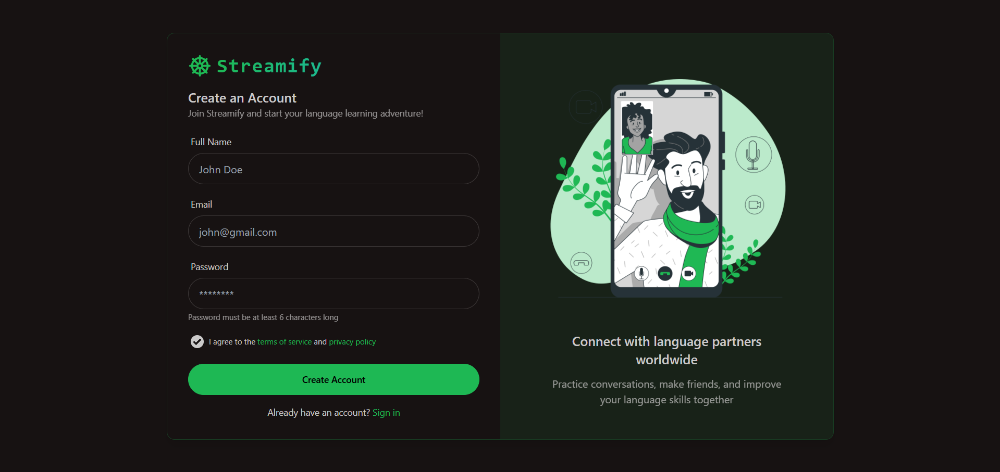
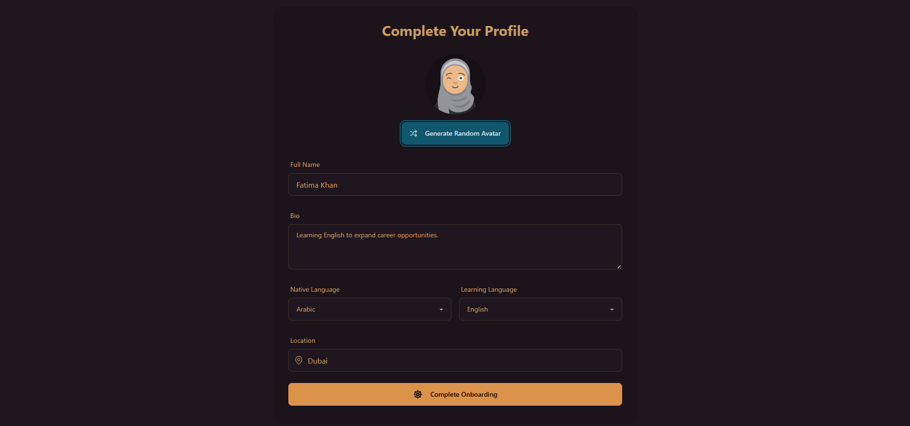
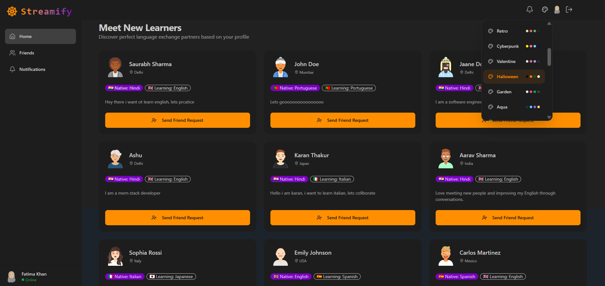
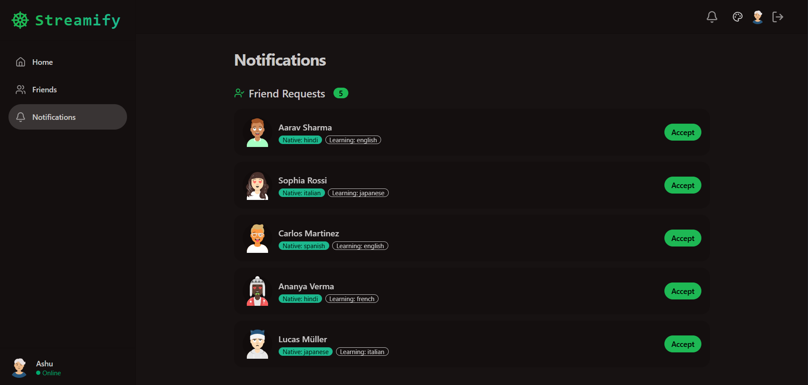
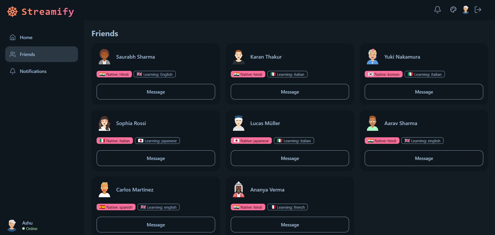
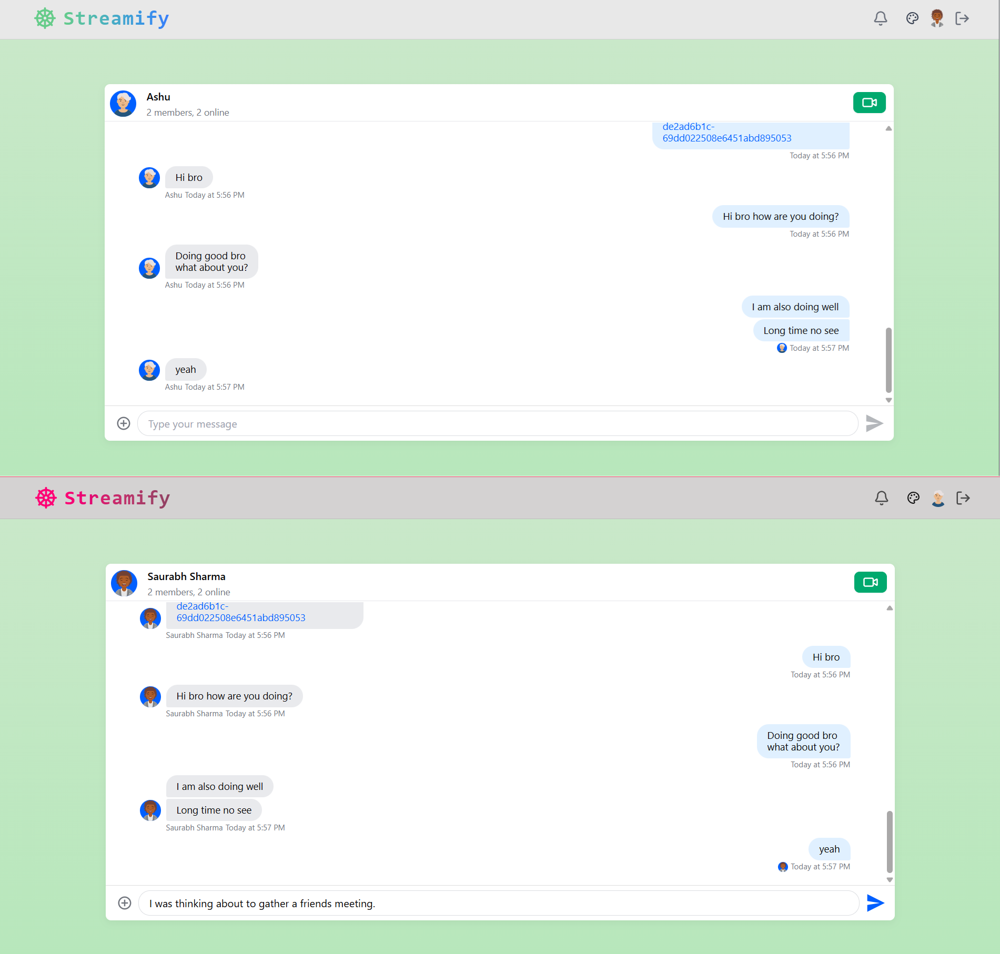
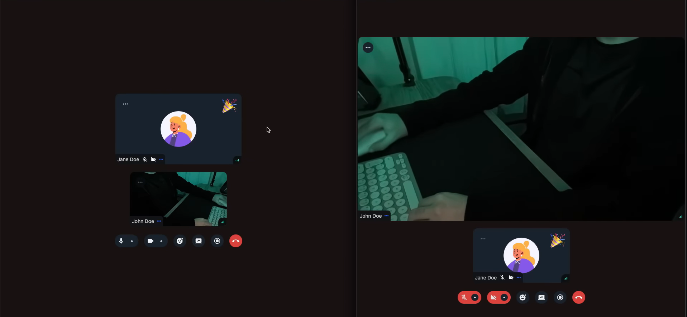
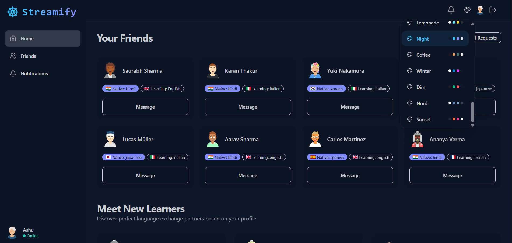

# 📽️ Streamify — Real-Time Language Exchange & Social Platform

<p align="center">
  
  
  
  
  
  
</p>

---

## 🚀 Overview

- Built a full-stack real-time platform enabling users to **connect, chat, and video call seamlessly**
- Combines **social networking + live communication + language learning**
- Powered by **Stream APIs** for scalable chat and video interactions
- Implements a complete **social graph system (friends, requests, recommendations)**
- Demonstrates **end-to-end ownership (UI → API → DB → real-time layer)**
- Multiple **theme** support with dynamic switching

### 💡 Key Highlights

- Real-time **chat + video calling**
- Secure **JWT authentication with session persistence**
- Handles **CORS and cross-domain communication**
- Designed for **scalability and production-grade behavior**

---

## 🌐 Live Demo

👉 https://streamify-lel1.onrender.com/

---

## 🧠 Core Features

### 🔐 Authentication & Session Management

- Secure JWT authentication using **HTTP-only cookies**
- Persistent sessions with `/auth/me`
- Protected routes using middleware
- Handles real-world deployment issues (CORS, cookies, domains)

---

### 👤 Onboarding & User Profiles

- Structured onboarding flow:
  - Bio
  - Native language
  - Learning language
  - Location
- DiceBear avatar generation
- Access control until onboarding completion

---

### 🤝 Social Graph System

- Friend discovery & recommendations
- Send / accept friend requests
- Incoming + outgoing request tracking
- Dynamic friends list management

---

### 💬 Real-Time Messaging

- 1:1 chat using **Stream Chat**
- Deterministic channel creation
- Instant UI updates
- Scalable real-time messaging architecture

---

### 📹 Video Calling (Key Feature)

- 1:1 video calls via **Stream Video SDK**
- Seamless chat → call flow
- Call session creation using channel IDs

---

### 🌍 Language Exchange System

- Match users based on:
  - Native language  
  - Learning language  
- Enables meaningful connections beyond generic social apps

---

### 🎨 Modern UI/UX

- Tailwind CSS + daisyUI
- Theme switching (Zustand)
- Responsive layouts
- Toast notifications & loaders

---

## 📸 Screenshots

### 📝 Signup
<p align="center">
  
</p>

> User-friendly account creation flow with clean UI and validation.

---

### 🧑 Onboarding
<p align="center">
  
</p>

> Structured onboarding to capture user bio, language preferences, and location.

---

### 🌍 Discover Users
<p align="center">
  
</p>

> Find new language partners based on profile, location, and learning preferences.

---

### 🔔 Notifications (Friend Requests)
<p align="center">
  
</p>

> Accept or manage incoming friend requests with real-time updates.

---

### 👥 Friends
<p align="center">
  
</p>

> View and manage your connections with language preferences and quick messaging access.

---

### 💬 Chat Interface
<p align="center">
  
</p>

> Real-time one-to-one messaging with clean UI and instant updates.

---

### 📹 Video Calling
<p align="center">
  
</p>

> Seamless video communication integrated directly into the chat experience.

---

### 🏠 Dashboard
<p align="center">
  
</p>

> Central hub for navigation, activity overview, and quick access to features.

---

## 🛠️ Tech Stack

### Frontend
- React 19 + Vite
- React Router
- TanStack Query
- Axios
- Zustand
- Tailwind CSS + daisyUI
- Stream Chat & Video SDKs

### Backend
- Node.js + Express
- MongoDB + Mongoose
- JWT + Cookie-based authentication
- bcryptjs
- Stream Chat Server SDK
- CORS + cookie-parser

---

## 🏗️ System Architecture

Client (React UI)<br/>
↓ <br/>
API Layer (Axios + Auth)<br/>
↓ <br/>
Express Routes <br/>
↓ <br/>
Controllers (Business Logic)<br/>
↓ <br/>
MongoDB (Users / Friends / Requests)<br/>
↓ <br/>
Stream Services (Chat + Video)

---

## ⚡ Key Engineering Challenges & Learnings

### 🔐 Cross-Domain Authentication (CORS + Cookies)

- Handling authentication across separate frontend/backend deployments
- Required:
  - correct CORS configuration
  - `sameSite: "none"` cookies
  - debugging production-only issues

---

### 📡 Real-Time Integration

- Managing chat and video through external SDKs
- Syncing UI state with async real-time events
- Handling token-based initialization securely

---

### 🧠 State Management Complexity

- Managing global state across:
  - authentication
  - chat
  - friends
  - UI feedback
- Improved understanding of real-world data flow

---

### 🐛 Production Debugging

Solved real issues like:
- Route mismatches on deployment
- CORS failures
- Cookie persistence bugs
- Environment variable misconfigurations

---

## 📦 Project Structure

```text
Streamify/
├── backend/
│   ├── controllers/
│   ├── models/
│   ├── routes/
│   ├── middleware/
│   └── server.js
│
├── frontend/
│   ├── components/
│   ├── pages/
│   ├── lib/
│   ├── store/
│   └── App.jsx
```

---

## 🚧 Future Improvements

- Real-time presence (online/offline status)
- Group chat & group video calls
- Message delivery status (sent, delivered, seen)
- Push notifications
- Redis caching for scalability
- Advanced user search & ranking
- WebSocket upgrade for real-time layer

---

